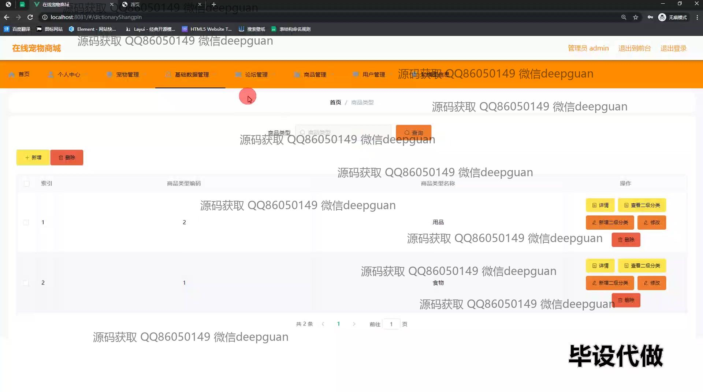
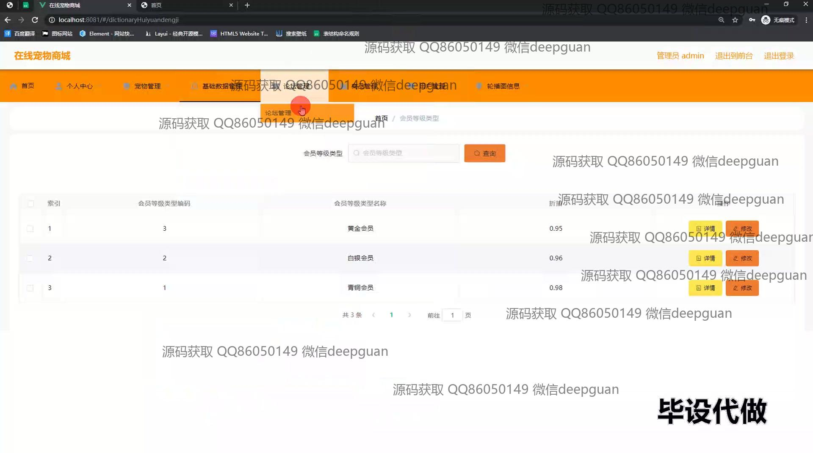

<h1 align="center">基于VUE+SSM框架的在线宠物商城+vue</h1>

## 简介
在线宠物商城系统：角色包括管理员和用户；提供宠物管理、订单管理、会员等级管理和个人信息管理等功能，基于VUE3和SSM框架开发，用于用户友好互动和项目展示。    --计算机毕业设计源码；毕设源码；java毕业设计源码

## 联系方式

<h3 align="center">获取完整代码与数据库文件 + 微信：deepguan QQ: 86050149 QQ群: 783742310</h3>

<h3 align="center">可帮忙远程部署 包运行成功！提供远程部署、修改代码、设计文档指导、代码讲解等服务！</h3>

## 功能介绍（完整见运行截图）
管理员：负责平台的日常管理工作，包括城市数据的新增和修改以及会员等级的管理。具备审核功能，能够审核用户提交的宠物订单，并查看订单的详细信息。管理员还可以通过后台管理界面对商品类型进行增删改操作，以维持系统的数据更新和准确性。同时，他们可以管理预约订单，通过条件搜索进行订单筛选和查看详情。

用户：用户可以通过个人中心查看和管理自己的信息，包括账户名、邮箱、余额、积分和会员等级等，并支持头像上传。用户能够维护和管理自己的收货地址、商品收藏、宠物收藏及订单信息，并可以预定宠物。在用户中心，用户还可以进行余额充值，便于后续的购物操作。用户在商品页面可以通过搜索和筛选功能查找心仪商品，并将其添加到购物车中进行结算。

## 运行截图

本代码来源于网络,仅供学习参考使用!

